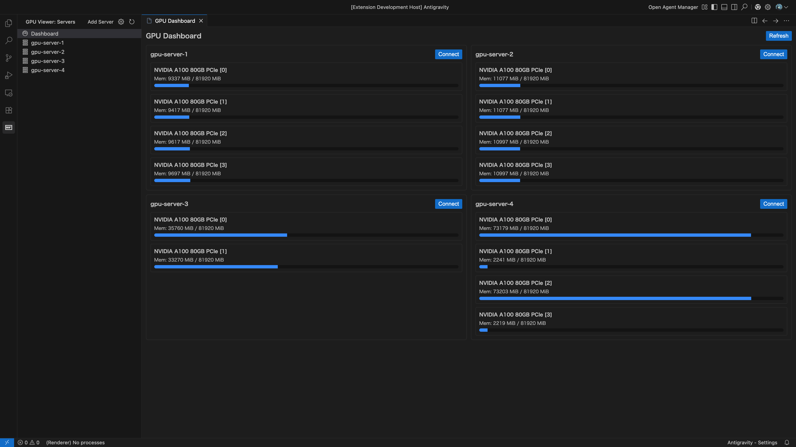
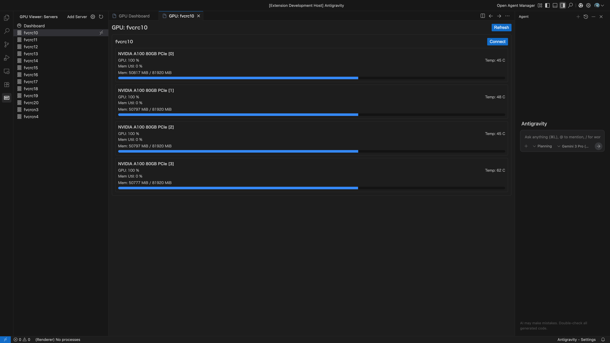

# GPU Server Viewer

A VSCode extension to visualize GPU usage (utilization, memory, temperature, etc.) of remote GPU servers.
It uses `ssh` and `nvidia-smi` to fetch information.

→ [Install for VSCode](https://marketplace.visualstudio.com/items?itemName=gpu-server-viewer.gpu-server-viewer)

## Features

### Dashboard (List View)
View the status of all registered GPU servers at a glance.
Memory usage is displayed with a progress bar, and you can easily SSH connect to each server.

### Individual View
View detailed status (GPU utilization, temperature, memory usage) for each GPU on a specific server.

### Key Features
- **Multi-Server Monitoring**: Monitors hosts defined in `~/.ssh/config` or specified in settings.
- **Local SSH Config Support**: Works seamlessly even when connected to a remote server (Remote-SSH), using your local SSH configuration.
- **SSH Connection**: Connect to target servers via VSCode Remote SSH with a single click.
- **Visibility Configuration**: Easily select or hide monitored servers via GUI.
- **Auto-Refresh**: Status is automatically updated (configurable).

## Requirements

- `ssh` command must be available on the local machine.
- `nvidia-smi` must be installed on the remote servers.
- Password-less SSH connection (e.g., public key authentication) to remote servers must be established.

## Settings

This extension has the following settings:

* `gpu-server-viewer.sshConfigPath`: Path to the SSH configuration file (Default: `~/.ssh/config`).
* `gpu-server-viewer.targets`: List of hostnames to monitor (If not specified, all hosts in the SSH config file are monitored).
* `gpu-server-viewer.ignoredHosts`: List of hostnames to exclude from the view (Can be changed from the "Configure Servers" menu).
* `gpu-server-viewer.autoRefresh`: Enable/disable auto-refresh (Default: `true`).
* `gpu-server-viewer.refreshInterval`: Refresh interval in seconds (Default: `5`).

## Usage

1. Click the extension icon in the Activity Bar to automatically open the Dashboard.
2. The "GPU Server List" in the Side Bar displays a list of servers.
3. You can also open the Dashboard by clicking the "Dashboard" item in the list.
4. Click the "Connect" button on each server card to open a new window connected to that server via SSH.
5. Click the gear icon at the top of the server list to select or deselect servers to display.
